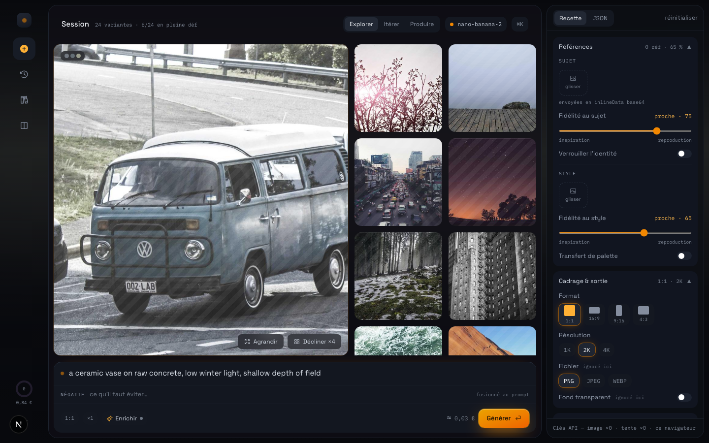
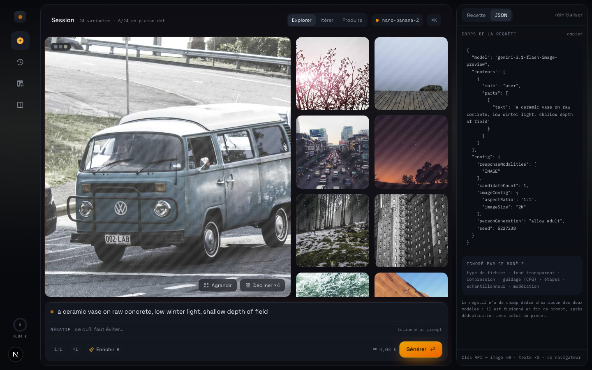

<div align="center">

# img-creator

**A local-first workshop for image generation.**
One prompt, several models, side by side — no account, no database, no server that keeps your keys.

[](https://github.com/samuelboulery/img-creator/actions/workflows/ci.yml)
[](LICENSE)
[](https://nextjs.org)
[](tsconfig.json)

[Quick start](#quick-start) · [Why](#why) · [Models](#models) · [How it works](#how-it-works) · [Français](README.fr.md)



<sub>Demo session: the visuals are royalty-free photographs, not model output. Regenerate the screenshots with <code>node scripts/screenshots.mjs</code>.</sub>

</div>

---

## Why

Most image-generation front-ends hide the request. You move a slider, something happens, and you never learn whether the model actually received the value — or silently dropped it.

img-creator does the opposite. **The JSON tab shows the real request body**, built by the same pure function the adapter sends. Parameters a model does not support are pruned from the payload *and* labelled `ignoré ici` in the panel. What you see is what leaves your browser.

<div align="center">

</div>

## Features

- **Two models, one prompt** — `nano-banana-2` (Gemini 3.1 Flash Image) and `gpt-image-2`, with an A/B mode that runs both in parallel on identical input.
- **Four working modes** — *Explore* (fan out), *Iterate* (refine one result), *Produce* (contact sheet), *Compare* (A/B two models).
- **Honest payloads** — every adapter exposes a pure `buildPayload()`. The inspector renders that exact object, never a reconstruction.
- **Per-model capabilities** — a single source of truth (`lib/adapters/capabilities.ts`) drives both payload pruning and the "ignored here" badges.
- **Recipes** — save references, weights, prompt suffix, negative and render settings as a reusable preset. Export and import as plain `.json`.
- **Subject & style references** — drag images in, weight them from *inspiration* to *reproduction*, lock identity, transfer palette.
- **Prompt enrichment** — rewrite a prompt through a text model using *your* key. No server key is ever used for this.
- **Ambient background** — the dominant palette of the last result tints the room around the canvas. Never the images themselves.
- **Local cost estimate** — a per-image price you can edit; the app queries no pricing API.
- **Command palette** — <kbd>⌘K</kbd> / <kbd>Ctrl+K</kbd>, plus <kbd>⏎</kbd> to generate.

## Quick start

```bash
git clone https://github.com/samuelboulery/img-creator.git
cd img-creator
pnpm install
pnpm dev
```

Open <http://localhost:3000>, paste an API key into the onboarding card, and you are in the workshop.

> **pnpm only.** `npm`, `yarn` and `bun` are not supported — the lockfile and the `packageManager` field pin pnpm.

### Getting keys

| Model | Key from |
|---|---|
| `nano-banana-2` | [Google AI Studio](https://aistudio.google.com/apikey) |
| `gpt-image-2` | [OpenAI platform](https://platform.openai.com/api-keys) |

Keys are typed by you, held in `localStorage`, and forwarded as an `x-api-key` header to this app's own API routes. They are never bundled, never logged, never persisted server-side.

### Optional server fallback

For a shared demo instance you can supply fallback keys instead — copy `.env.local.example` to `.env.local`:

```bash
GEMINI_API_KEY=...   # optional fallback for nano-banana-2
OPENAI_API_KEY=...   # optional fallback for gpt-image-2
```

Prompt enrichment deliberately has **no** server fallback: it always spends the user's own text key, or stays inactive.

## Models

| Capability | `nano-banana-2` | `gpt-image-2` |
|---|:---:|:---:|
| Aspect ratio | ✅ | ✅ `size` |
| Resolution | ✅ `imageConfig.imageSize` | ✅ derived quality (1K→low, 2K→medium, 4K→high) |
| Variants per run | ✅ `candidateCount` | ✅ `n` |
| Seed | ✅ | — |
| File type / transparency / compression | — | ✅ |
| `personGeneration` | ✅ | — |
| Moderation | — | ✅ |
| Image references | ✅ `inlineData` | ✅ |
| Guidance (CFG), steps, sampler | — | — |

Neither API exposes a dedicated negative-prompt field, so the negative is **merged into the end of the prompt** after de-duplication against the recipe's own negative. The panel says so, and the JSON tab shows the result.

## How it works

```
app/
  page.tsx                 shell: rail · drawer · canvas · panel
  api/generate/route.ts    image proxy — validates, rate-limits, picks adapter
  api/enrich/route.ts      prompt rewrite with the user's text key
components/atelier/
  modes/     Explore · Iterate · Produce · Compare
  panel/     SettingsPanel · RecipeTab · JsonTab · ReferenceGrid · RawParams
  drawers/   History · Recipes · Enrich · Settings
  overlays/  Viewer · CommandPalette · Onboarding
lib/
  adapters/  capabilities · nano-banana-2 · gpt-image-2 · shared · payload
  atelier/   use-atelier (state) · reducer · storage · recipes · palette · diff · cost
```

Adding a model is one file in `lib/adapters/` implementing `GenerateImageAdapter`, plus one entry in `capabilities.ts`. The UI, the payload pruning and the "ignored here" badges follow automatically.

**Design rules the codebase holds itself to:**

- No API call leaves a React component — everything goes through `app/api/`.
- No secret in a `NEXT_PUBLIC_*` variable, ever.
- TypeScript strict, no `any`, no state mutation.
- Deliberate shortcuts carry a `ponytail:` comment naming their ceiling.

### Privacy & storage

Nothing is stored outside your browser. `localStorage` holds:

| Key | Contents |
|---|---|
| `gemini_api_key` · `openai_api_key` · `text_api_key` | your keys |
| `imgc.recipes` | saved presets |
| `imgc.session` | current session, capped, images as base64 |
| `imgc.params` · `imgc.prefs` · `imgc.onboarded` | settings and UI state |

The API routes apply a naive in-memory rate limit (10 requests/minute per IP). It resets on restart and does not survive multiple instances — enough for a single self-hosted deployment, not for a public service.

## Scripts

```bash
pnpm dev         # dev server on :3000
pnpm build       # production build
pnpm lint        # ESLint
pnpm typecheck   # tsc --noEmit
pnpm test        # Vitest — pure logic (adapters, reducer, storage, recipes…)
pnpm test:e2e    # Playwright — critical path
```

## Contributing

Issues and pull requests are welcome. Before opening a PR, run `pnpm lint && pnpm typecheck && pnpm test`.

The UI copy and code comments are in French; identifiers and this README are in English. New code should follow the same split.

## License

[MIT](LICENSE) © Samuel Boulery
